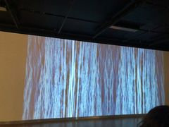

# Le Fleuve, 50° 11′ 53,8” N., 66° 4′ 10″ O. (2022)
>#### *Catherine Béchard et Sabin Hudon* 

### - Originaire de Québec Catherine Béchard et Sabin Hudon Forent un "duo d’artistes depuis 1999. Leur pratique sonde les entre-espaces, les variations et les écarts subtils du temps. Elle se situe au croisement de paramètres multiples tels que la vue et l’ouïe, la matérialité et sa résonance, l’espace et la durée, le mouvement et l’immobilité, le son, le silence et l’écoute." texte tiré de [Art Pubique Montréal](https://artpublicmontreal.ca/artiste/bechard-et-hudon/) 

### - réalisée en 2021

### - Configurations du sensible 2022, présentée a la Maison des arts de Laval, Québec, Canada

### - Visitée le jeudi le 17 mars 2022

## Description de l'oeuvre ou du dispositif multimédia

"Comme le suggèrent les coordonnées géographiques de l’intitulé, cette œuvre s’attache à un lieu en particulier. Il s’agit de la Pointe de Moisie, à proximité de Sept-Îles : une niche écologique offrant un panorama exceptionnel sur le territoire fluvial du Saint-Laurent qui, à cette hauteur, se confond avec la mer. C’est là que fut tourné le riche bassin d’images ayant servi à cette composition visuelle qui, par des jeux de dédoublements en enfilade, verse dans une abstraction hypnotique. Si le paysage marin que l’on devine fait écho aux sonorités aquatiques de L’en deçà, les flots géométrisés, parfois finement striés, dialoguent librement avec les Mécanismes de dessaisissement. — Aseman Sabet" texte tiré de [Béchard Hudon](https://bechardhudon.com/project/sans-titre-no-title-2021/) 

## Explications sur la mise en espace de l'oeuvre ou du dispositif 

Projection d'une video monobande de 32 min (en boucle). Il faut donc l'accès a un espace spacieux pour y pouvoir projeter la vidéo. La vidéo doit aussi etre accompagné de la bande sonnore qui est présenté dans l'oeuvre précédent (L’EN DEÇA), mais qui joue tout de meme un grand role dans cet oeuvre (le fleuve).

## Liste des composantes et techniques de l'oeuvre ou du dispositif 

- projecteur
- ordinateur
- systéme de son
- cable de connection de l'ordinateur au projecteur 
- cable de connection de l'ordinateur au système de son

## Liste des éléments nécessaires pour la mise en exposition

### - une pièce spacieuse

 *la piece doit avoir une lumière faible pour permettre de bien voir l'oeuvre*

### - une prise électrique

# Expérience vécue

## Description de mon expérience de l'oeuvre ou du dispositif, de l'interactivité, des gestes à poser, etc.
J'ai adoré l'expérience visuelle et auditive de cette oeuvre. 
## ❤️ Ce qui m'a plu et qui m'a donné des idées 
J'ai beaucoup aimé l'idée d'intégrer le son de l"oeuvre précédente dans celle-ci. Le son est subtile mais il s'accorde parfaitement avec l'image et créer une ambiance apaisante et calme. Sans la bande de son, j'aurais eu une expérience totalement différente.

## 🤔 Aspect que je ne souhaite pas retenir pour mes propres créations ou que je ferais autrement

### Références
[Site 1](https://artpublicmontreal.ca/artiste/bechard-et-hudon/) 
[Site 2](https://bechardhudon.com/project/sans-titre-no-title-2021/) 
