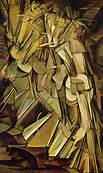
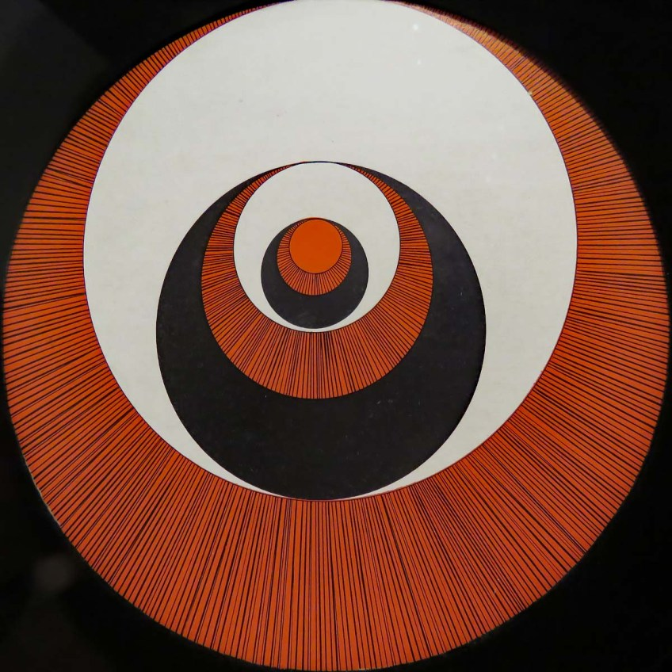

# Nu descendant un escalier paramétrique

### - Réalisé par Rafael Lozano-Hemmer

### - Né en 1967 au Mexique. Rafael vit et travaille présentement à Montréal (Québec,Canada)

### - Oeuvre réalisée en 2018

### - Le nom de l'exposition est BIAN métamorphosis

### - Exposé à l'Arsenal d'Art Contemporain de montréal 

### - Visité le 10 février 2022

# Description de l'oeuvre ou du dispositif multimédia

### Comme expliqué dans cette référence, cette oeuvre " est une animation générative montrant une descente sans fin dans un escalier en colimaçon". On peut parfois apercevoir des ombres sur les escaliers. Cette oeuvre génère toujours des nouvelles possibilitées d'images, il n'y a donc jamais la même image 2 fois!

## Explications sur la mise en espace de l'oeuvre ou du dispositif 

### L'oeuvre est présenter dans un espace spacieux. on peut remarquer un fil noir qui est relié à un cube blanc. Ce cube blanc sert à cacher l'ordinateur et quelque fils (prise de charge pour l'ordinateur et les fils de  connexions) pour rendre la présentation plus épurée. L'ordinateur contient l'information. Cette information est ensuite projetée sur l'écran circulaire par des câbles noirs.  

## Liste des composantes et techniques de l'oeuvre ou du dispositif 

### - Logiciel de programmation générative écrit avec TouchDesigner

### - Écran circulaire DEL fait sur mesure (256 x 256)

### - Un ordinateur

### - Un diffuseur acrylique

### - Du gel rosco

### - Un cardre en acier

### - Une vitrine

### - Des câbles pour diffuser les images de l'ordinateur jusqu'a l'écran

## Liste des éléments nécessaires pour la mise en exposition

### - une pièce spacieuse ( l'oeuvre fait 19-7 pouces/50cm de diamètre avec 3pouces/8cm de profondeur)

 *la piece doit avoir une lumière faible ou de la lumière naturelle*

### - une prise  électrique avec un courant de charge de plus de 200W 110-240V

# Expérience vécu

###  J'ai beaucoup aimé l'expérience visuelle de l'oeuvre. Le fait que les escaliers descendent à l'infini créer une ilustion que j'ai adoré. Les ombres sur les escaliers et l'effet de "sans fin"  créer une certaine intrigue. Rafael a créé cette oeuvre pour rendre hommage à "deux compositions picturales de l'artiste Marcel Duchamp, *Nu descendant un escalier (1912)* et *Rotoreliefs(1935).* Je trouve que son oeuvre est digne d'un bon hommage. On remarque facilement le clin d'oeil que Rafael a fait en regardant ces oeuvres:

## ❤️ Ce qui m'a plu et qui m'a donné des idées 

### Comme dit  précédemment, j'ai adoré l'effet de "sans fin". Cela me fait réfléchir sûr qu'est-ce qu'il pourrait avoir au bout de l'escalier! J'aimerais ajouter cette illusion dans l'un de mes projet de video prochainement. Cela serait une bonne source d'inspiration. J'ai aussi beaucoup aimé l'endroit choisi pour projeter cette oeuvre. elle est exposée dans une pièce séparer des peintures de l'Arsenal d'Art Contemporain de montréal. Cela m'a rendu calme et apaisé car j'avais l'imression que la piece était plus silencieuse que les autres.

## 🤔 Aspect que je ne souhaite pas retenir pour mes propres créations ou que je ferais autrement

### Pour etre honnete, j'aurais enlevé le gros fils noirs qui était sur le plancher:

j'aurais plutot essayé de faire passer les fils dans le sols car je trouve que le fil noir enlève cette effet 'd'épuré'

# Références

[site 1](https://www.lozano-hemmer.com/descending_a_parametric_staircase.php)

[site 2](arsenalcontemporary.com/mtl/fr/residency/detail/rafael-lozano-hemmer)

