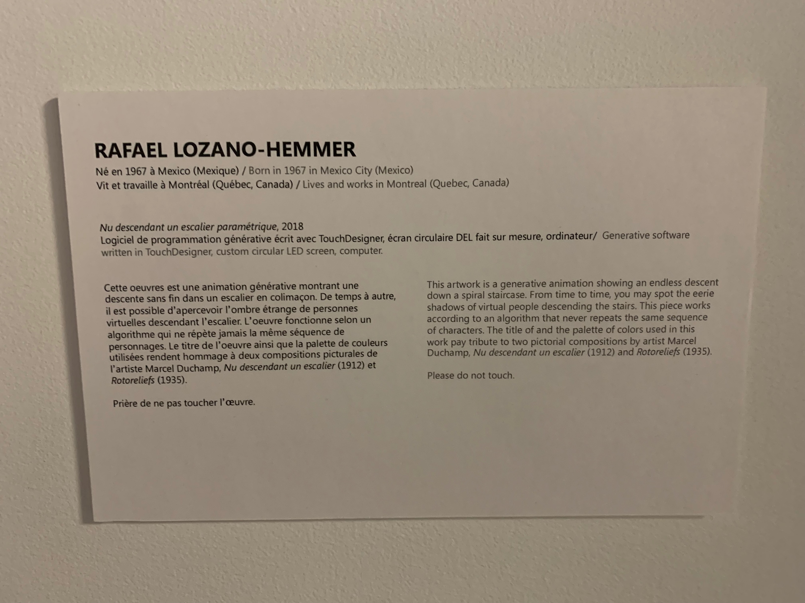
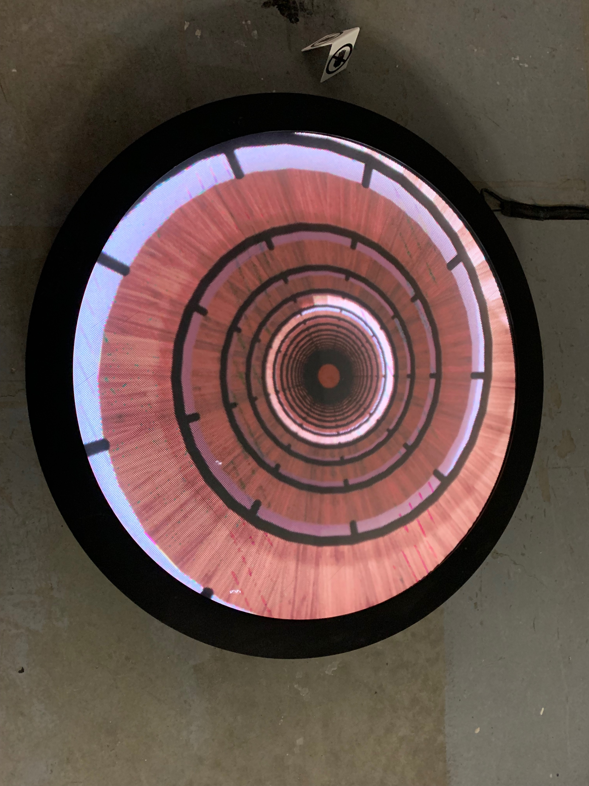
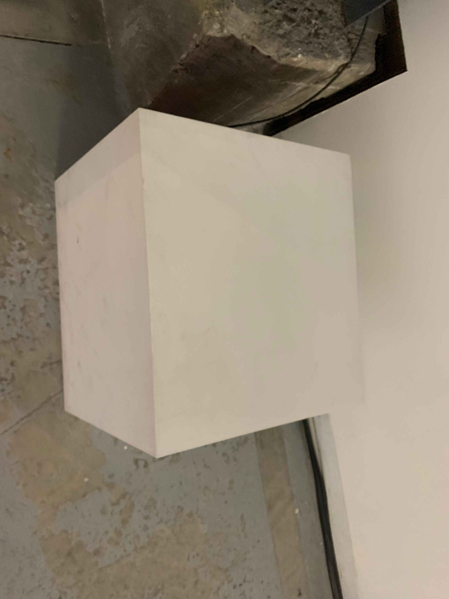
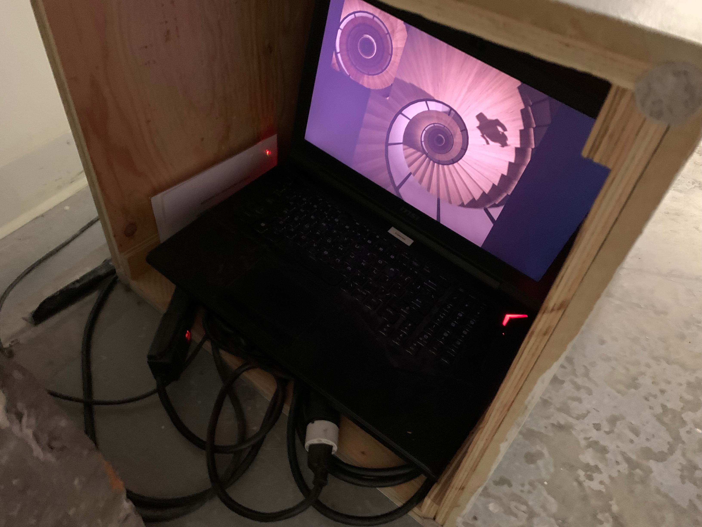

# Nu descendant un escalier paramétrique

### - Réalisé par Rafael Lozano-Hemmer

### - Né en 1967 au Mexique. Rafael vit et travaille présentement a Montréal (Québec,Canada)

### - Oeuvre réalisée en 2018

### - Le nom de l'exposition est BIAN métamorphosis

### - Exposé a l'Arsenal d'Art Contemporain de montréal 

### - Visité le 10 Février 2022

# Description de l'oeuvre ou du dispositif multimédia

### Comme expliqué dans cette référence, cette oeuvre " est une animation générative montrant une descente sans fin dans un escalier en collimacon". On peut parfois appercevoir des ombres sur les escaliers. Cette oeuvre génere toujours des nouvelles possibilitées d'image, il n'y a donc jamais la meme image 2 fois!

## Explications sur la mise en espace de l'oeuvre ou du dispositif 

### L'oeuvre est présenter dans un espace spacieux. on peut remarquer un fil noir qui est relié a un cube blanc. Ce cube blanc sert a cacher l'ordinateur et quelque fils (prise de charge pour l'ordinateur et les fils de connections) pour rendre la présentation plus épurée. L'ordinateur contient l'information. Cette information est ensuite projetée sur l'écran circulaire par des cables noirs.  

## Liste des composantes et techniques de l'oeuvre ou du dispositif 

### - Logiciel de programmation générative écrit avec TouchDesigner

### - Écran circulaire DEL fait sur mesure (256 x 256)

### - Un ordinateur

### - Un diffuseur acrylique

### - Du gel rosco

### - Un cardre en acier

### - Une vitrine

### - Des cables pour diffuser les images de l'ordinateur jusqu'a l'écran

## Liste des éléments nécessaires pour la mise en exposition

### - une piece spacieuse ( l'oeuvre fait 19-7 pouces/50cm de diamètre avec 3pouces/8cm de profondeur)

 *la piece doit avoir une lumière faible ou de la lumière naturelle*

### - une prise éléctrique avec un courant de charge de plus de 200W 110-240V

# Expérience vécu

###  J'ai beaucoup aimé l'expérience visuel de l'oeuvre. Le fait que les esacliers descendent a l'infini créer une ilustion que j'ai adoré. Les ombres sur les escaliers et l'effet "sans fin"  créer une certaine intrigue. Rafael a créer cette oeuvre pour rendre hommage a "deux compositions picturales de l'artiste Marcel Duchamp, *Nu descendant un escalier (1912)* et *Rotoreliefs(1935).* Je trouve que son oeuvre est digne d'un bon hommage. On remarque facilement le clin d'oeil que Rafael a fait en regardant ces oeuvres:

## ❤️ Ce qui m'a plu et qui m'a donné des idées 

## 🤔 Aspect que je ne souhaite pas retenir pour mes propres créations ou que je ferais autrement

# Références

[site 1](https://www.lozano-hemmer.com/descending_a_parametric_staircase.php)

[site 2](arsenalcontemporary.com/mtl/fr/residency/detail/rafael-lozano-hemmer)

