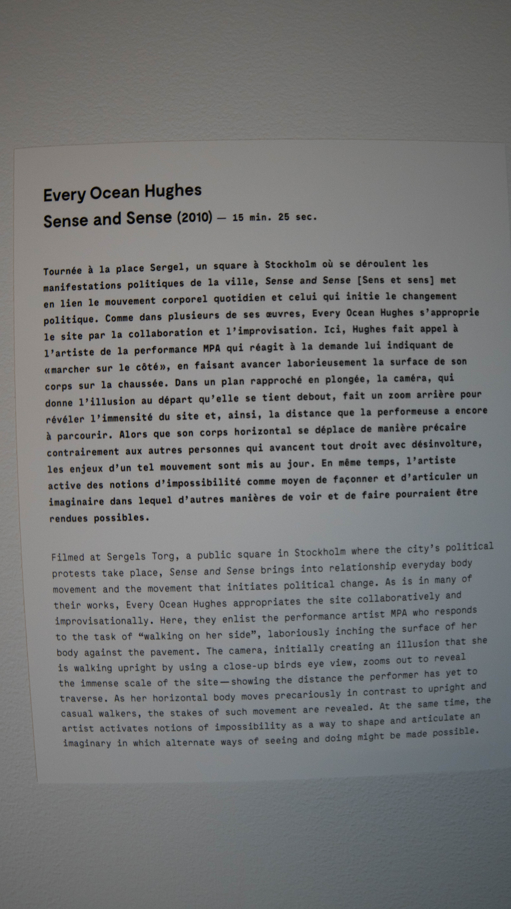
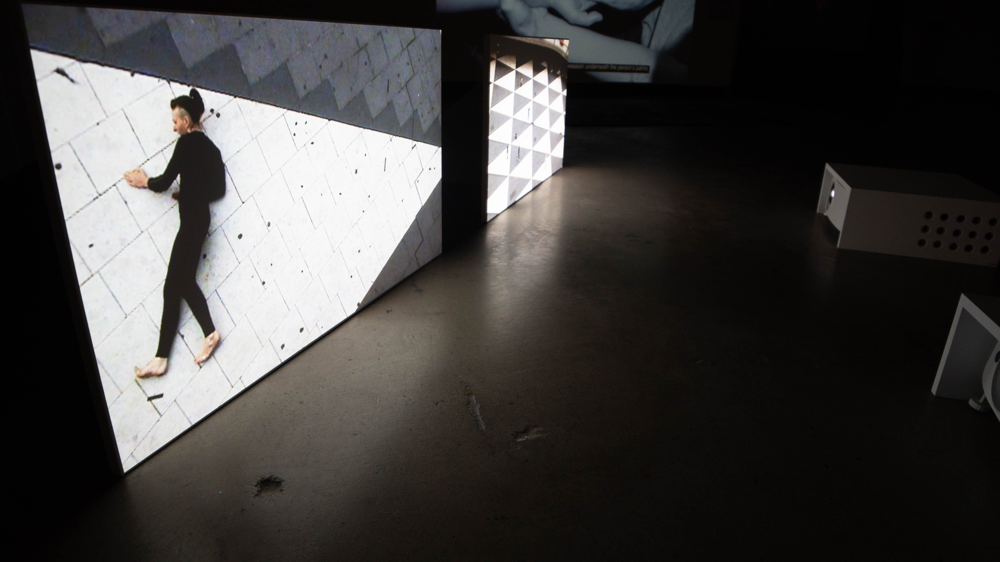
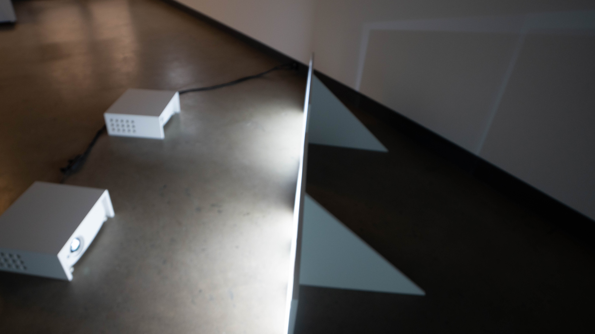
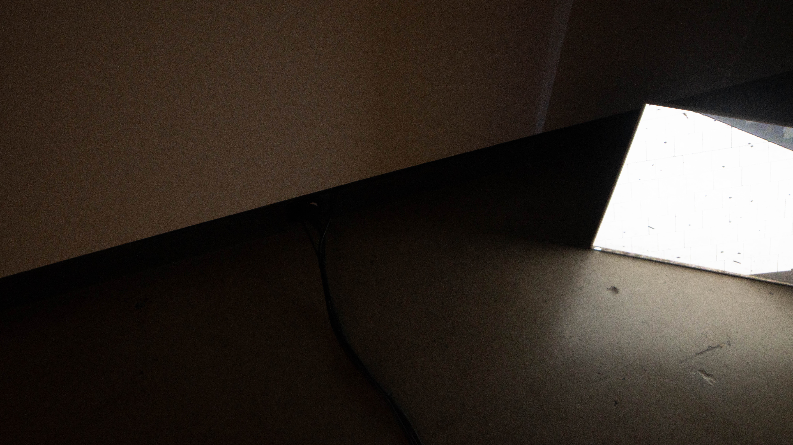

# Sense and Sense (2010)
>#### *Every Ocean Hughes* 

### - Every Ocean Hughes (né en 1977), anciennement connu sous le nom d'Emily Roysdon, est une artiste et écrivaine basée à New York et Stockholm, actuellement professeure d'art à Konstfack à Stockholm, en Suède.

### - réalisée en 2010

### - proximité · plaisir · plasticité regard sur la performance 2022, présentée par Dazibao, Québec, Canada.

### - Visitée le mardi le 3 Mai 2022

## Description de l'oeuvre ou du dispositif multimédia

## Explications sur la mise en espace de l'oeuvre ou du dispositif 

projections de vidéos tournées par Every Ocean et projettées sur deux rectangles blancs au sol.

## Liste des composantes et techniques de l'oeuvre ou du dispositif 

- 2 projecteurs
- ordinateur
- cable de connection de l'ordinateur au projecteur 
- 2 rectangles de toile pour projecter les vidéos

## Liste des éléments nécessaires pour la mise en exposition

### - une pièce spacieuse

 *la piece doit avoir une lumière faible pour permettre de bien voir la projection sur les deux toiles*
 
 ### - sans trop de bruits

 *éviter de perturber le silence de l'oeuvre*

### - une prise électrique

# Expérience vécue

## Description de mon expérience de l'oeuvre ou du dispositif, de l'interactivité, des gestes à poser, etc.

J'ai beaucoup aimé l'expérience. Le fait que les vidéos ne dégagent aucun son nous permet de vraiment nous concentrer sur ce qui se passe. Le concpet de projetter sur deux écrans nous permet d'avoir deux points de vue différents. L'Un de proche et l'autre de loin. 

## ❤️ Ce qui m'a plu et qui m'a donné des idées 

J'ai adoré le fait que les videos soient projetter au sol et non sur un mur. Cela permet de la différencier des autres oeuvres de l'exposition qui étaient tous projettées sur des murs. J'ai de plus aimé voir que Every Ocean a créer cette oeuvre en relation a la politique du pays qui se passait en 2010. J'ai trouvé qu'elle l'a bien représenté.

## 🤔 Aspect que je ne souhaite pas retenir pour mes propres créations ou que je ferais autrement
Parcontre, le fait que les videos étaient un peu trop bas au sol. Moi-meme (de taille moyenne) devait me mettre dans une position inconfortable pour pouvoir bien voir l'oeuvre. J'aurais donc suspendu les deux toiles pour une meilleure expériece.

[Site 1](https://dazibao.art/exposition-proximite-plaisir-plasticite-regard-sur-la-performance)
